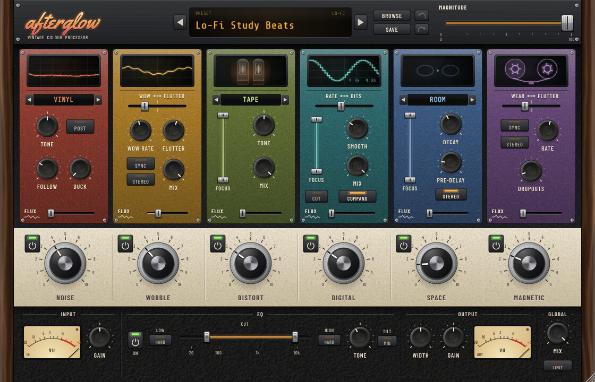
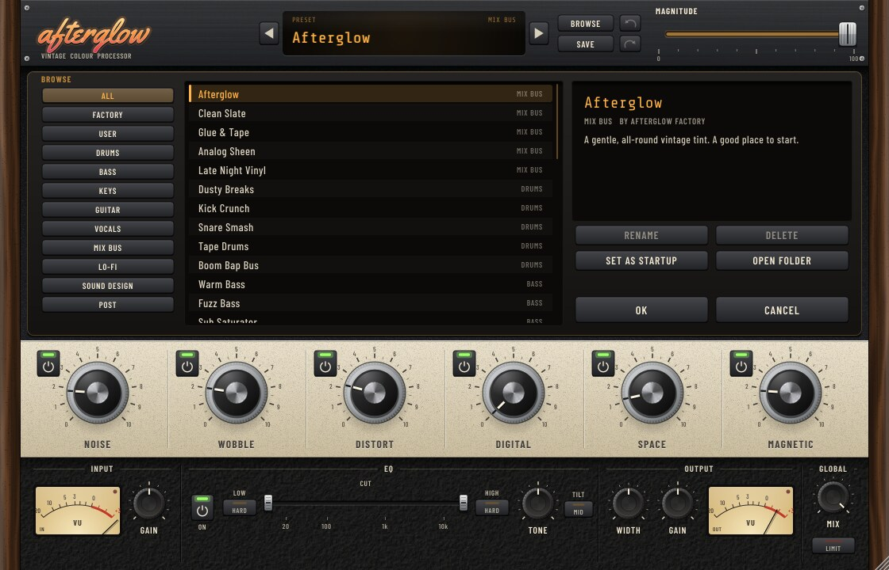

# Afterglow

**Afterglow** is a vintage colour and texture processor (VST3, AU and Standalone) inspired by XLN Audio's RC-20
Retro Color. It adds the character of old recording gear to any sound: noise beds, tape wow and flutter, saturation,
early-sampler grit, vintage reverbs and worn-tape artefacts, all brought to life by a per-module **Flux** engine.



## Highlights

* **Six modules** in signal order, each with its own big knob, power switch and Flux control:
  * **Noise**: 16 noise characters synthesised in real time (Vinyl, Shellac, Tape, Cassette, VHS, Hum 50/60, Buzz,
    Fuzz, Room, Radio, Transmission, 8-Bit, White, Pink, Brown) with Tone, Follow, Duck and Pre/Post routing.
  * **Wobble**: wow and flutter with stereo chorus mode, Mix and tempo sync.
  * **Distort**: Tube, Transformer, Speaker, Tape, Fuzz, Clip, Fold and Rectify, oversampled up to 8x, with a
    two-handle Focus band, Tone, Mix and automatic level matching.
  * **Digital**: sample-rate and bit reduction with Rate/Bits balance, Smooth filters, mu-law Compand, Focus band and CUT.
  * **Space**: Ambience, Room, Plate, Hall, Spring and a 12-note chromatic Resonator (16-line FDN reverb).
  * **Magnetic**: tape wear, flutter (with tempo sync) and dropouts, mono or stereo.
* **Magnitude**: one slider that scales every module and the master section, from clean to full effect.
* **Master section**: input gain, EQ (low and high cut with soft or hard slopes, Tilt or Mid tone), width,
  output gain, global dry/wet Mix, soft safety limiter and two analogue VU meters.
* **Presets**: 40 factory presets in 9 categories, user presets, a browser you can tweak while browsing
  (OK keeps, Cancel restores), a startup preset, and undo/redo.
* **Skeuomorphic interface**: walnut cheeks, enamel faceplates, knurled knobs, illuminated buttons, animated glass
  displays (oscilloscope, glowing valves, stepped samples, reverb ripples, spinning reels) and perforated covers for
  switched-off modules. Resizable from 60 % to 220 %, sharp on high-DPI screens.
* **Quality**: every module is exactly transparent at 0 %, latency is reported and compensated, and the test suite
  covers null tests, latency, stability fuzzing, presets, calibration and aliasing. See
  [docs/RESEARCH.md](docs/RESEARCH.md) for the full RC-20 analysis, DSP design and measurements.



## Download a ready-made build

Every push builds the plugin on Windows, macOS and Linux with GitHub Actions.

1. Open the repository on GitHub and click the **Actions** tab.
2. Click the latest successful **Build** run.
3. Under **Artifacts**, download **Afterglow-Windows** (or macOS / Linux) and unzip it.

### Install on Windows 10

1. Copy the **Afterglow.vst3** folder to `C:\Program Files\Common Files\VST3\`
   (Windows asks for administrator permission).
2. Open your DAW and rescan plugins (for example: Ableton Live > Options > Preferences > Plug-Ins > Rescan;
   FL Studio > Options > Manage plugins > Find plugins; Reaper > Options > Preferences > VST > Re-scan).
3. **Afterglow.exe** is the standalone version and runs without a DAW.

## Build from source on Windows 10

1. Install **Git for Windows**: https://git-scm.com/download/win
2. Install **Visual Studio 2022 Community**: https://visualstudio.microsoft.com/vs/community/
   In the installer, tick the workload **Desktop development with C++** (it includes the compiler, the Windows SDK
   and CMake).
3. Open **Developer PowerShell for VS 2022** from the Start menu and run:

   ```powershell
   git clone https://github.com/104stars/afterglow.git
   cd afterglow
   cmake -S . -B build -G "Visual Studio 17 2022" -A x64
   cmake --build build --config Release --target Afterglow_VST3 Afterglow_Standalone AfterglowTests
   ```

   The first configure downloads JUCE automatically (about 100 MB), so it needs an internet connection.

4. The results are in:
   * `build\Afterglow_artefacts\Release\VST3\Afterglow.vst3`
   * `build\Afterglow_artefacts\Release\Standalone\Afterglow.exe`

5. Install the VST3 (from a PowerShell window opened with **Run as administrator**, inside the `afterglow` folder):

   ```powershell
   Copy-Item -Recurse -Force build\Afterglow_artefacts\Release\VST3\Afterglow.vst3 "C:\Program Files\Common Files\VST3\"
   ```

   Alternatively, configure with `-DAFTERGLOW_COPY_AFTER_BUILD=ON` from an administrator Developer PowerShell and the
   plugin is copied there after every build.

6. Optional: run the test suite.

   ```powershell
   build\AfterglowTests_artefacts\Release\AfterglowTests.exe
   ```

To work in the Visual Studio IDE instead, open `build\Afterglow.sln`, choose the **Release** configuration and build
the `Afterglow_VST3` project.

### macOS and Linux

```bash
cmake -S . -B build -DCMAKE_BUILD_TYPE=Release        # macOS universal: add -G Xcode -DCMAKE_OSX_ARCHITECTURES="arm64;x86_64"
cmake --build build --config Release --parallel
```

On Linux install the JUCE dependencies first (see `.github/workflows/build.yml` for the package list).
macOS builds from CI are not notarised; remove the quarantine flag with `xattr -dr com.apple.quarantine <plugin>`.

## Using Afterglow

| Control | What it does |
| --- | --- |
| Big knobs | How much of each module you hear. 0 % bypasses the module completely. |
| Power buttons | Switch a module on or off. A switched-off module is covered by a steel grille; click the grille or grab its big knob to switch it on. |
| Magnitude | Scales all six big knobs plus input, output, EQ and width together. Amber markers on the big knobs show the resulting values. |
| Flux | Organic, never-repeating drift of each module's key parameters. A little adds life; a lot gets wild. |
| Focus bands | Drag either handle to set the band, drag the middle to move it, double-click to reset. |
| SYNC (Wobble, Magnetic) | Locks the rate to the host tempo; the rate knob then selects note values. |
| Global Mix | Dry/wet for the whole processor, with the dry signal aligned to the plugin latency. |
| LIMIT | Soft safety limiter on the output. |

Mouse and keyboard: drag knobs up or down, hold **Shift** for fine control, **double-click** to reset, use the
**mouse wheel** for small steps. **Ctrl+Z** undoes and **Ctrl+Shift+Z** (or **Ctrl+Y**) redoes. Click the logo
for help, oversampling quality and interface size.

User presets are XML files in `Documents\Afterglow\Presets`, so they can be backed up or copied to another computer.

## Project layout

```
source/dsp        audio engine: one class per module, master section, utilities
source/presets    preset manager and the factory presets
source/ui         look and feel, controls, textures, module panels, displays, browser
tests             test runner (TestMain.cpp) and the UI snapshot tool (SnapshotMain.cpp)
docs              research notes and screenshots
resources/fonts   embedded fonts and their licences
```

## Licences

* Afterglow is built with [JUCE](https://juce.com), which is available under the AGPLv3 or a commercial JUCE licence.
  Distributing Afterglow binaries therefore requires either releasing the source under the AGPLv3 or holding a
  JUCE licence.
* Fonts: Barlow Condensed and Share Tech Mono (SIL Open Font License 1.1), Yellowtail (Apache License 2.0).
  Licence texts are in `resources/fonts`.
* RC-20 Retro Color is a product and trademark of XLN Audio. Afterglow is an independent project that is not
  affiliated with or endorsed by XLN Audio, and contains none of its code, samples or artwork.
